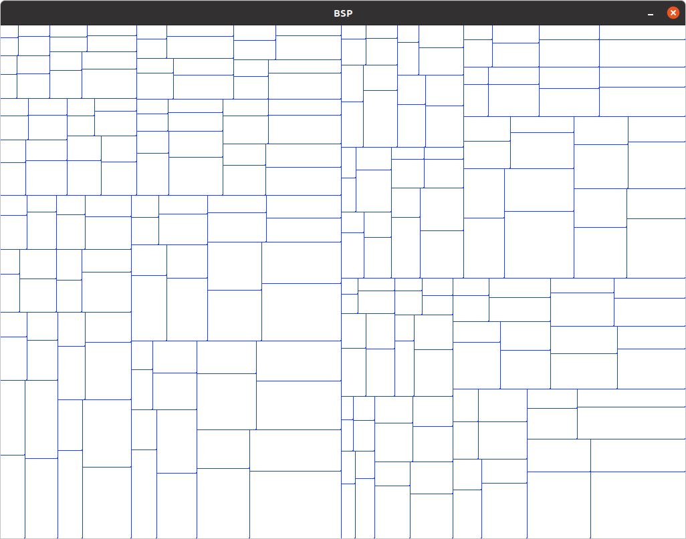

# BSP Procedural Generation

It's actually more like quad space partition.

Just divides the space in the middle, given a certain percentage to deviate from the middle, and does it for
a specified depth

